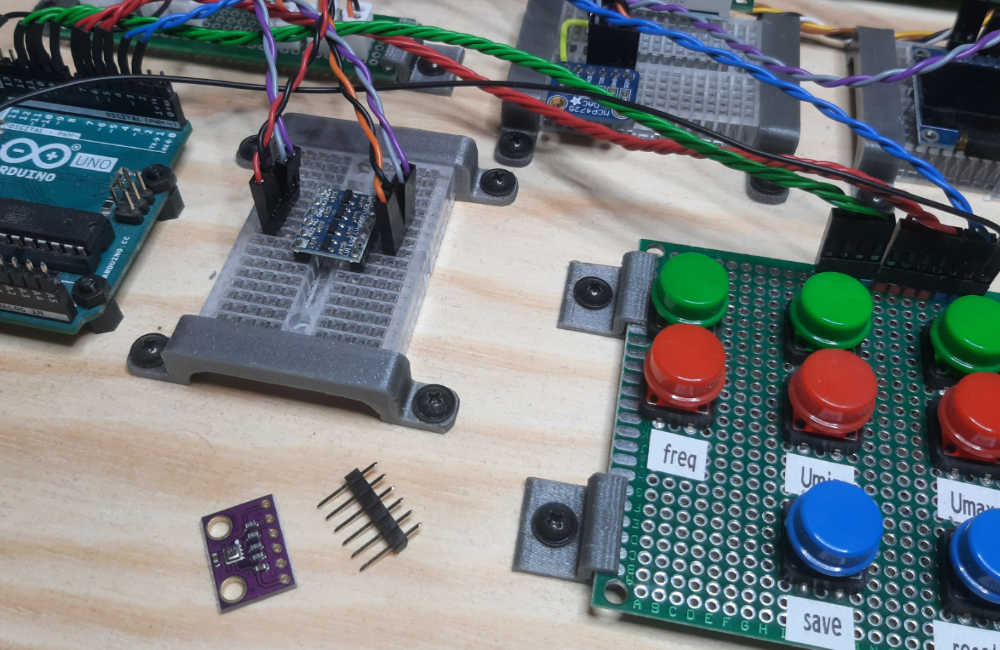

# Prototyping Mount

Small 3d-printable parts to mount parts of electric prototypes to a wooden board. This project includes mounts for small breadboards and 1.6mm thick PCBs.

_(a wooden board with different parts mounted on it)_
